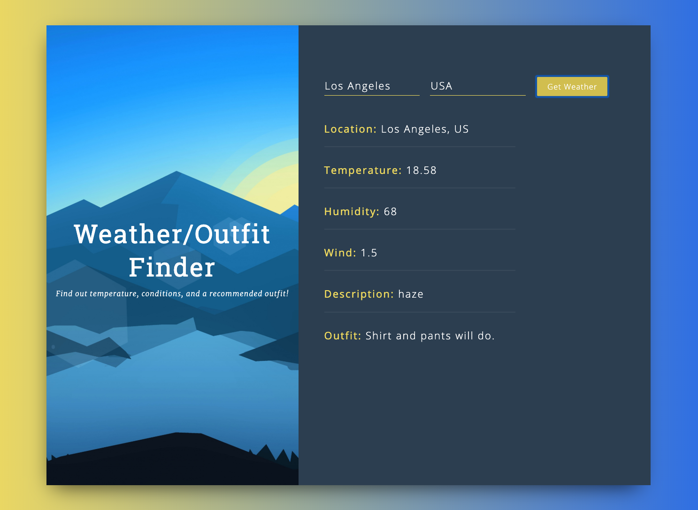
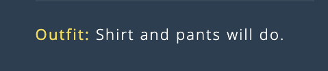

## Weather / Outfit Recommender Application ##

Uses the OpenWeatherMap API to fetch weather data and Brain.js to recommend an outfit type to the user. 

## Motivation ##

The motive behind this web app was to take a well known, data-driven idea, then rebuild and maintain it from the ground up in order to learn the fundamentals behind designing and programming a React Web Application. I also wanted to apply the skills and tools that I learned from Andrew Ng's Machine Learning course to this project; hence, the birth of the underdeveloped outfit recommender. 

## Build Status ##

This project is mainly for proof-of-concept. The fetching of weather API data and error handling runs beautifully. The outfit recommender system mainly lacks data as examples must be manually labelled so only a couple were used. Even so, however, the predictor is quite powerful and performs relatively well. Techniques such as feature scaling, mean normalization, and neural networks were used to train and fit the data. 

## Technology and frameworks used ##

**Built with**
  * ReactJS
  * HTML + CSS
  * [WeatherAPI](https://openweathermap.org/api)
  * [BrainJS](https://github.com/BrainJS/brain.js)
  
## Installation ## 

1. Clone this repository. 
2. Navigate to the directory from the command line then run 'npm start'.

## How To Use ## 

1. Type in a city and country in the text fields. 
2. Hit the 'Get Weather' button.
3. Repeat and enjoy!

## Credits ## 

Credits for the weather fetching API tutorial and CSS styling go to Hamza Mirza. His tutorials on YouTube are extremely detailed and helpful for students like me who are new to programming React applications. 

## Support ## 

If you find any of my projects helpful/inspiring and would like to support me, please do so [here](https://venmo.com/Micah-Yong "Venmo")
